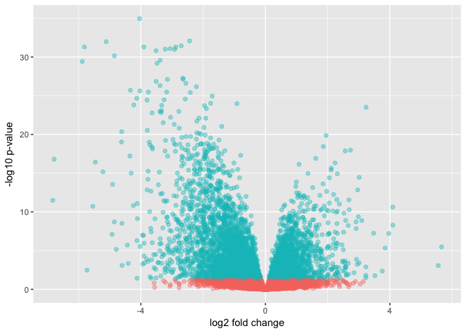

```r
library("ggplot2")
library("dplyr")
```

```
## Warning: package 'dplyr' was built under R version 3.4.2
```

```
## 
## Attaching package: 'dplyr'
```

```
## The following objects are masked from 'package:stats':
## 
##     filter, lag
```

```
## The following objects are masked from 'package:base':
## 
##     intersect, setdiff, setequal, union
```

```r
NC <- read.table("../results/DESeq2/NC_DESeq2_genesymb.tsv", header=1, sep='\t')
# NCL <- NCL[complete.cases(NCL), ]
NCL <- read.table("../results/DESeq2/NC_DESeq2_genesymb_FDR5%_filtered.tsv", header=1, sep='\t')
NCL_genes <- (NCL[,1])
```


```r
##Highlight genes that have an absolute fold change > 2 and a p-value < Bonferroni cut-off
# if_else( abs(log2FoldChange) > 2 & padj < 0.05), "B" ))
NC <- NC%>%mutate(threshold = ifelse(abs(padj) < 0.05, "B",
                              ifelse(abs(log2FoldChange) > 2 & padj <0.05, "C",
                              ifelse(abs(log2FoldChange)> 2 & padj < 0.05 &  gene_symbol %in%
                                       NCL_genes, "D", "A"))))

# ）NC$threshold = as.factor(abs(NC$log2FoldChange) > 2 & NC$padj < 0.05)
 
##Construct the plot object
g <- ggplot(data=NC, 
            aes(x=log2FoldChange, y=-log10(padj), 
            colour=threshold)) +
  geom_point(alpha=0.4, size=1.75) +
  theme(legend.position="none") + 
  #opts(legend.position = "none") +
 # xlim(c(-10, 10)) + ylim(c(0, 15)) +
  xlab("log2 fold change") + ylab("-log10 p-value") #+ 
  scale_colour_manual(values=c("red", "black"))
```

```
## <ggproto object: Class ScaleDiscrete, Scale>
##     aesthetics: colour
##     axis_order: function
##     break_info: function
##     break_positions: function
##     breaks: waiver
##     call: call
##     clone: function
##     dimension: function
##     drop: TRUE
##     expand: waiver
##     get_breaks: function
##     get_breaks_minor: function
##     get_labels: function
##     get_limits: function
##     guide: legend
##     is_discrete: function
##     is_empty: function
##     labels: waiver
##     limits: NULL
##     make_sec_title: function
##     make_title: function
##     map: function
##     map_df: function
##     n.breaks.cache: NULL
##     na.translate: TRUE
##     na.value: NA
##     name: waiver
##     palette: function
##     palette.cache: NULL
##     position: left
##     range: <ggproto object: Class RangeDiscrete, Range>
##         range: NULL
##         reset: function
##         train: function
##         super:  <ggproto object: Class RangeDiscrete, Range>
##     reset: function
##     scale_name: manual
##     train: function
##     train_df: function
##     transform: function
##     transform_df: function
##     super:  <ggproto object: Class ScaleDiscrete, Scale>
```

```r
g
```

```
## Warning: Removed 2520 rows containing missing values (geom_point).
```

<!-- -->

```r
library("ggrepel")
```

```
## Warning: package 'ggrepel' was built under R version 3.4.2
```

```r
# g + geom_text_repel(data=filter(NC, padj<0.05 & gene_symbol %in% NCL_genes, 
                                # aes(label=gene_symbol)))
```


```r
# 1 %in% vec
# ggplot()
# with(NC, plot(log2FoldChange, -log10(padj), pch=20, main="Differentially Expressed Genes between NASH and HCC using DESeq2"))
# 
# with(subset(NC, padj<.05 ), points(log2FoldChange, -log10(padj), pch=20, col="red"))
# with(subset(NC, abs(log2FoldChange)>1), points(log2FoldChange, -log10(padj), pch=20, col="orange"))
# with(subset(NC, padj<.05 & abs(log2FoldChange)>1), points(log2FoldChange, -log10(padj), pch=20, col="green"))
# with(subset(NC, padj<.05 & abs(log2FoldChange)>1), points(log2FoldChange, -log10(padj), pch=20, col="green"))
# with(subset(NC, padj<.05 & abs(log2FoldChange)>1& NC$gene_symbol %in% NCL_genes), points(log2FoldChange, -log10(padj), pch=20, col="blue"))


# Label points with the textxy function from the calibrate plot
library('calibrate')
```

```
## Loading required package: MASS
```

```
## 
## Attaching package: 'MASS'
```

```
## The following object is masked from 'package:dplyr':
## 
##     select
```

```r
library("ggrepel")

# p <- ggplot(NCL, aes(log2FoldChange, -log10(pvalue)) + geom_point(aes(col=(NCL$padj<0.05))) + scale_color_manual(values=c("red", "black")))
# p
# p+geom_text(data=filter(results, padj<0.05), aes(label=Gene))

# with(subset(NC, padj<.05 & abs(log2FoldChange)>1 & NC$gene_symbol %in% NCL_genes ), textxy(log2FoldChange, -log10(padj), labs=gene_symbol, cex=.75))
# geom_text_repel()
```


```r
# data <- read.table("../data/processed_raw_counts.tsv", sep='\t', row.names = 1, header = TRUE)
# healthy <- data[,grepl("H",names(data))]
# steatosis <- data[,grepl("S",names(data))]
# nash <- data[,grepl("N",names(data))]
# cancer <- data[,grepl("C",names(data))]
```


```r
# library(Rtsne) # Load package
# # iris_unique <- unique(iris) # Remove duplicates
# # set.seed(99) # Sets seed for reproducibility
# # tsne_out <- Rtsne(as.matrix(iris_unique[,1:4])) # Run TSNE
# # plot(tsne_out$Y,col=iris_unique$Species) # Plot the result
# set.seed(123)
# 
# hT <- t(healthy)
# healthy <- unique(healthy)
# tsne_out <- Rtsne(as.matrix(healthy))
# prcomp(healthy, scale = FALSE)
# library(factoextra)
# res.pca <- prcomp(healthy, scale = TRUE)
# res.pca
# # fviz_eig(res.pca)
# # fviz_pca_ind(res.pca,
# #             # col.ind = "cos2", # Color by the quality of representation
# #              gradient.cols = c("#00AFBB", "#E7B800", "#FC4E07"),
# #              repel = TRUE     # Avoid text overlapping
# #              )
# # library(ggplot2)
# 
# # create data frame with scores
# # scores = as.data.frame(res.pca$sdev)
# # 
# # plot of observations
# # ggplot(data = scores, aes(x = PC1, y = PC2, label = rownames(scores))) +
# #   geom_hline(yintercept = 0, colour = "gray65") +
# #   geom_vline(xintercept = 0, colour = "gray65") +
# #   geom_text(colour = "tomato", alpha = 0.8, size = 4) +
# #   ggtitle("PCA plot of USA States - Crime Rates")
```


```r
# count=read.table('../data/processed_raw_counts.tsv',header = 1, row.names = 1)
# gene_length=read.table('../../Library/gene_length.txt',header = 1)
# countToTpm <- function(counts, effLen)
# {
#   rate <- log(counts) - log(effLen)
#   denom <- log(sum(exp(rate)))
#   exp(rate - denom + log(1e6))
# }
# tpm=countToTpm(count,gene_length$Length)
# 
# temp=colnames(count)
# conds=c()
# for(i in temp){
#   conds=append(conds,substr(i,1, 1))
# }
# 
# stages<-unique(conds)
# coldef.stage<-c("black","red","green","blue","cyan","magenta")
# names(coldef.stage) <- stages
# col.stage <- coldef.stage[conds]
# 
# library('Rtsne')
# library(rgl)
# PC<-prcomp(t(tpm))
# plot3d(PC$x[,1:3],col=col.stage,main="first PCA")
# 
# 
# tsne.out <- Rtsne(t(log2(tpm+1)),perplexity=10)
# 
# plot(tsne.out$Y,col=col.stage,main="tSNE")
# legend("topleft",stages,col=coldef.stage,pch=16,cex=0.5,bty='n')
```
